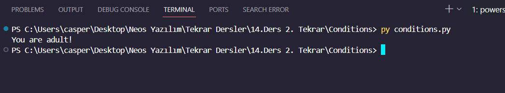

<h1><i>CONDITIONS PYTHON EXAMPLE</i></h1>

In this project, I implemented Python code to prompt the user to enter an age and then determine whether the person is an adult or a child, printing the result in the console.

